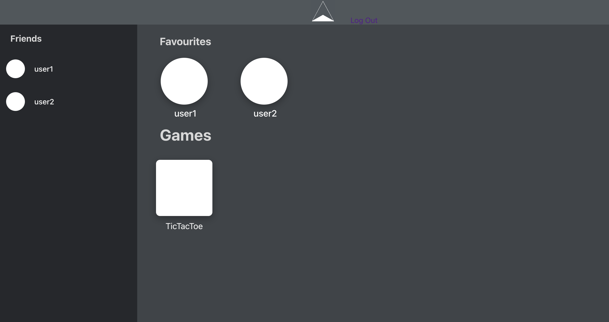

# Dissonance
## Description

---
Dissonance is a message based app that allows you to chat and play games with your friends.

## Planning

# <a href="https://trello.com/b/9aaaaUVZ/project-4-react"> Trello<a>

## Screenshots

### Landing Page
  

## Technologies

---

List of Technologies used

HTML || CSS || JavaScript || React.js || Socket.io || bcrypt || CORS || Axios || Timeago.js || Node.js || Mongoose

## Getting Started

<a href="https://dissonancechat.herokuapp.com/">Check out Dissonance HERE</a>

## AAU

1. I want to be able to have real time conversation with another user

## Next Steps

---

1. AAU, I want to be able to play simple games in real-tiem with another user
2. Sending join invitation to a friend
3. AAU, I want to be able to add other users as friends
4. Google Auth authentication
5. Upload your own profile pictures
6. Implement group chats for multiple user's to talk and play games for >2 people
7. Implement other genre's of multiplayer games 
8. Update UI to be more fluid with less redirection
